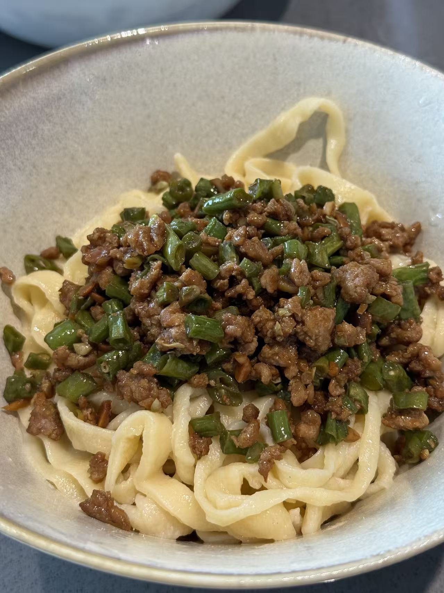
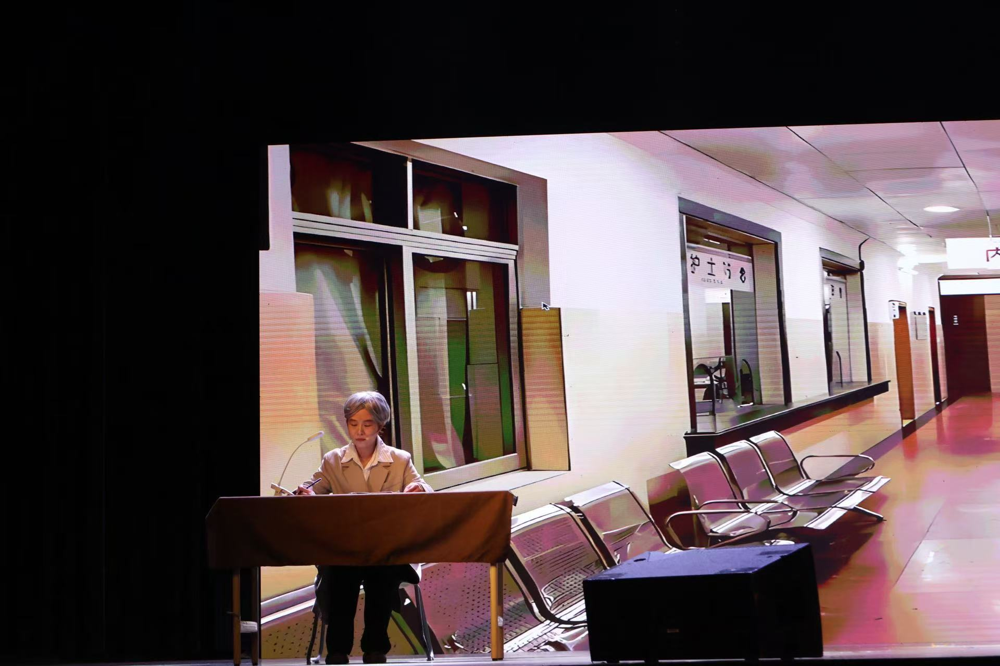

# Shuning Cheng 

- **Location**: Vancouver, Canada  
- **Email**: <chengshuning7@gmail.com>
- **Links:**  [CV](/assets/Shuning_Cheng_CV.pdf)
---

## About

I’m Shuning Cheng, a **University Counselor** at the College of Life Sciences, University of Chinese Academy of Sciences. I support **over 1,000 students** with day-to-day advising across academics, well-being, and career planning, and I organize activities and outreach. 

I led a **Counselor Studio** initiative that introduced a grid-based workflow and a plan–implementation–feedback–reimplementation cycle to improve communication and student support. 

I’m currently preparing to **apply for a PhD in Education**. My current research interest is how **generative AI** can support **personalized psychological counseling** in higher education—helping more students get timely support and better results, while respecting ethics and privacy.

---

## Research Interests
- Generative AI for mental‑health support
- Personalization & adaptive interventions
- Responsible AI in education: ethics, privacy, bias
- Program evaluation & cost‑effectiveness

---

## News   
**Sep 2025** — Drafted a proposal on AI‑enabled counseling personalization.  

---

## Experience

**Mar 2021 &ndash; Jul 2025,  University of Chinese Academy of Sciences, China**  
University Counselor & League Secretary (Full-Time)
- Student advising, crisis response, program coordination  
- Data‑informed initiatives for student well‑being

**Jan 2017 &ndash; Mar 2017,  Prudential Hong Kong Limited, China**  
Marketing Intern (Part-Time)
- Handled product photography; help select investment options
- Analyze data and tracke market intelligence

---

## Education

**Aug 2019 &ndash; Feb 2021, Fordham University, New York, US**  
Master of Science in Marketing Intelligence

**Sep 2015 &ndash; Jul 2019, Shandong Technology and Business University, Shandong, China**    
Bachelor of Management in Human Resource Management

---

## Project

**Mar 2021 &ndash; Mar 2025, University of Chinese Academy of Sciences, China**  
University Counselor Studio Project  
- **Inaugural model** construction project 
- **Grid-based student/class system** for timely check-ins and communication (critical during the pandemic)  
- **PDCA cycle** with an internal platform linking students and counselors  
- “Counselor Afternoon Tea” and Party group guidance; **UCAS-wide adoption**  

**Mar 2020 &ndash; Apr 2020, Geo-demographic Analysis by ZIP — Disney+**  
- Hierarchical clustering + ANOVA/t-tests on ZIP variables  
→ transfer: equity & access analysis for outreach/services

**Sep 2019 &ndash; Dec 2019, Large-Scale Customer Analytics — Williams-Sonoma**  
- Segmented ~100k participants; regression for behavior prediction  
→ transfer: student segmentation & retention modeling  

---

## Hobbies

**Cooking for Friends and Family**  
<!-- Responsive 3→2→1 grid for 6 photos -->

  

    <figure style="margin:0">
      
      <figcaption style="margin-top:6px;font-size:0.9rem;color:#555;">Chicken</figcaption>
    </figure>
    <figure style="margin:0">
      
      <figcaption style="margin-top:6px;font-size:0.9rem;color:#555;">Roujiamo</figcaption>
    </figure>
    <figure style="margin:0">
      
      <figcaption style="margin-top:6px;font-size:0.9rem;color:#555;">Hand Made Noodles</figcaption>
    </figure>
    <figure style="margin:0">
      
      <figcaption style="margin-top:6px;font-size:0.9rem;color:#555;">Dinner With Friends</figcaption>
    </figure>
    <figure style="margin:0">
      
      <figcaption style="margin-top:6px;font-size:0.9rem;color:#555;">Salmon</figcaption>
    </figure>
    <figure style="margin:0">
      
      <figcaption style="margin-top:6px;font-size:0.9rem;color:#555;">Pancakes</figcaption>
    </figure>
  

  

 

**Cat**  
<!-- Responsive 3→2→1 grid for 6 photos -->

  

    <figure style="margin:0">
      
      <figcaption style="margin-top:6px;font-size:0.9rem;color:#555;">Portrait</figcaption>
    </figure>
    <figure style="margin:0">
      
      <figcaption style="margin-top:6px;font-size:0.9rem;color:#555;">Childhood</figcaption>
    </figure>
    <figure style="margin:0">
      
      <figcaption style="margin-top:6px;font-size:0.9rem;color:#555;">Flower</figcaption>
    </figure>
    <figure style="margin:0">
      
      <figcaption style="margin-top:6px;font-size:0.9rem;color:#555;">Waiting Food</figcaption>
    </figure>
    <figure style="margin:0">
      
      <figcaption style="margin-top:6px;font-size:0.9rem;color:#555;">Stretch</figcaption>
    </figure>
    <figure style="margin:0">
      
      <figcaption style="margin-top:6px;font-size:0.9rem;color:#555;">Confuse</figcaption>
    </figure>
  

  

 

**Photography and Travel**  
<!-- Responsive 3→2→1 grid for 12 photos -->

  

    <figure style="margin:0">
      
      <figcaption style="margin-top:6px;font-size:0.9rem;color:#555;">Jeju Island</figcaption>
    </figure>
    <figure style="margin:0">
      
      <figcaption style="margin-top:6px;font-size:0.9rem;color:#555;">Seaside Church</figcaption>
    </figure>
    <figure style="margin:0">
      
      <figcaption style="margin-top:6px;font-size:0.9rem;color:#555;">Tokyo Tower</figcaption>
    </figure>

    <figure style="margin:0">
      
      <figcaption style="margin-top:6px;font-size:0.9rem;color:#555;">Lions Gate Bridge</figcaption>
    </figure>
    <figure style="margin:0">
      
      <figcaption style="margin-top:6px;font-size:0.9rem;color:#555;">Burnaby Mountain Park</figcaption>
    </figure>
    <figure style="margin:0">
      
      <figcaption style="margin-top:6px;font-size:0.9rem;color:#555;">Magnolia</figcaption>
    </figure>

    <figure style="margin:0">
      
      <figcaption style="margin-top:6px;font-size:0.9rem;color:#555;">Prayer Flags and Buddhist Temple</figcaption>
    </figure>
    <figure style="margin:0">
      
      <figcaption style="margin-top:6px;font-size:0.9rem;color:#555;">Guilin Mountains</figcaption>
    </figure>
    <figure style="margin:0">
      
      <figcaption style="margin-top:6px;font-size:0.9rem;color:#555;">Iron Fireworks</figcaption>
    </figure>

    <figure style="margin:0">
      
      <figcaption style="margin-top:6px;font-size:0.9rem;color:#555;">Horse and Lake</figcaption>
    </figure>
    <figure style="margin:0">
      
      <figcaption style="margin-top:6px;font-size:0.9rem;color:#555;">Lotus</figcaption>
    </figure>
    <figure style="margin:0">
      
      <figcaption style="margin-top:6px;font-size:0.9rem;color:#555;">Grassland</figcaption>
    </figure>
  

 

**Arts and Sports**  
<!-- Responsive 4→2→1 grid for 4 photos -->

  

    <figure style="margin:0">
      
      <figcaption style="margin-top:6px;font-size:0.9rem;color:#555;">Dance</figcaption>
    </figure>
    <figure style="margin:0">
      
      <figcaption style="margin-top:6px;font-size:0.9rem;color:#555;">Chorus</figcaption>
    </figure>
    <figure style="margin:0">
      
      <figcaption style="margin-top:6px;font-size:0.9rem;color:#555;">Stage Play</figcaption>
    </figure>
    <figure style="margin:0">
      
      <figcaption style="margin-top:6px;font-size:0.9rem;color:#555;">Air Volleyball</figcaption>
    </figure>
  

---

© {{ site.time | date: "%Y" }} Shuning Cheng. Built with GitHub Pages & Minimal theme.
